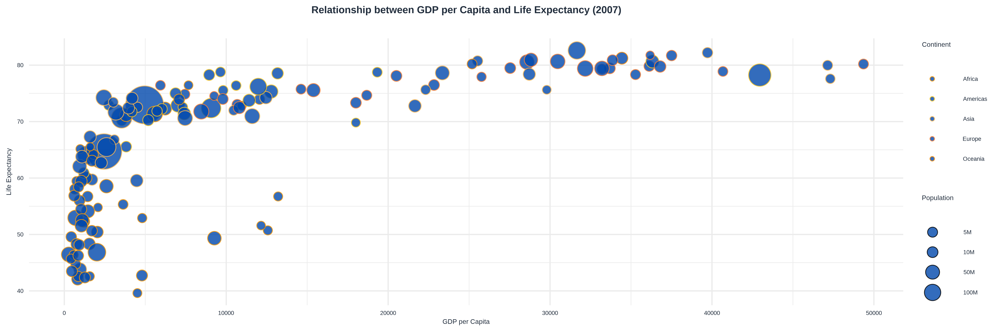

This code generates a data visualization that explores the relationship between GDP per capita and life expectancy using the gapminder dataset. The code first loads the necessary packages, including ggplot2 for plotting and gapminder for accessing the dataset.

The gapminder dataset contains information about various countries, including their GDP per capita, life expectancy, and population. To focus on a specific year, the code subsets the data for the year 2007 using the subset() function.

The plot is created using the ggplot() function, specifying the x-axis as GDP per capita, the y-axis as life expectancy, the size of data points as population, and the color of data points as continent. Custom colors are defined for each continent using the `scale_color_manual

### Code (R)

```R

# Load required packages
library(ggplot2)
library(gapminder)
library(showtext)

# Add Google Fonts
font_add_google("Montserrat")

# Set the font for the plot
showtext_auto()

# Load the gapminder dataset
data(gapminder)

# Subset the data for the year 2007
gapminder_2007 <- subset(gapminder, year == 2007)

# Define custom colors for continents
continent_colors <- c("#FFB000", "#FF4433", "#4488FF", "#00C957", "#AA00FF")

# Create the plot
gg <- ggplot(gapminder_2007, aes(x = gdpPercap, y = lifeExp, size = pop, color = continent)) +
  geom_point(alpha = 0.8, shape = 21, fill = "#0047AB", stroke = 0.5) +
  scale_size(range = c(3, 15), breaks = c(5000000, 10000000, 50000000, 100000000),
             labels = c("5M", "10M", "50M", "100M")) +
  scale_color_manual(values = continent_colors) +
  labs(
    title = "Relationship between GDP per Capita and Life Expectancy (2007)",
    x = "GDP per Capita",
    y = "Life Expectancy",
    color = "Continent",
    size = "Population"
  ) +
  theme_minimal() +
  theme(
    plot.title = element_text(size = 24, color = "#232F3E", hjust = 0.5, margin = margin(b = 20),
                              family = "Montserrat", face = "bold"),
    axis.title = element_text(size = 16, color = "#232F3E", family = "Montserrat"),
    axis.text = element_text(size = 14, color = "#232F3E", family = "Montserrat"),
    legend.title = element_text(size = 16, color = "#232F3E", family = "Montserrat"),
    legend.text = element_text(size = 14, color = "#232F3E", family = "Montserrat")
  )

# Save the plot as a PNG file
ggsave("gdp_life_exp.png", plot = gg, width = 10, height = 7, dpi = 300)


```

### Image (Zoomable)

