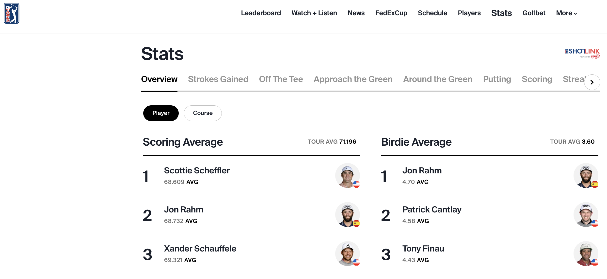
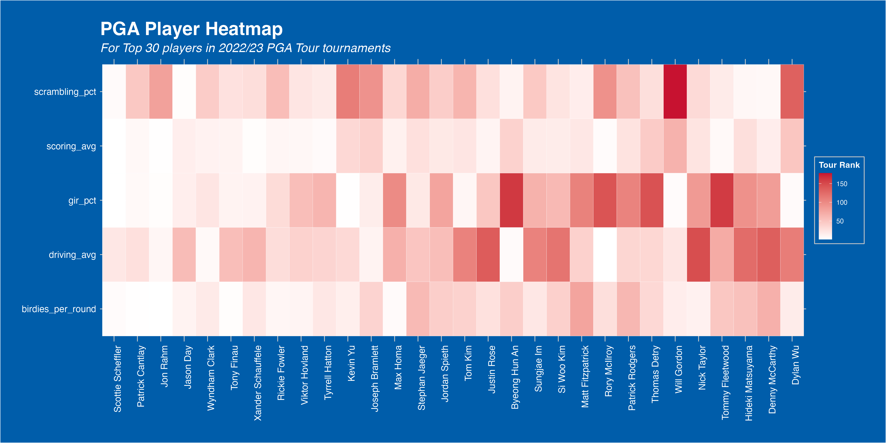
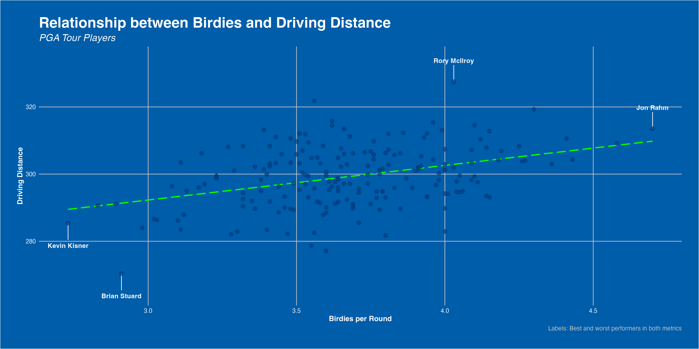
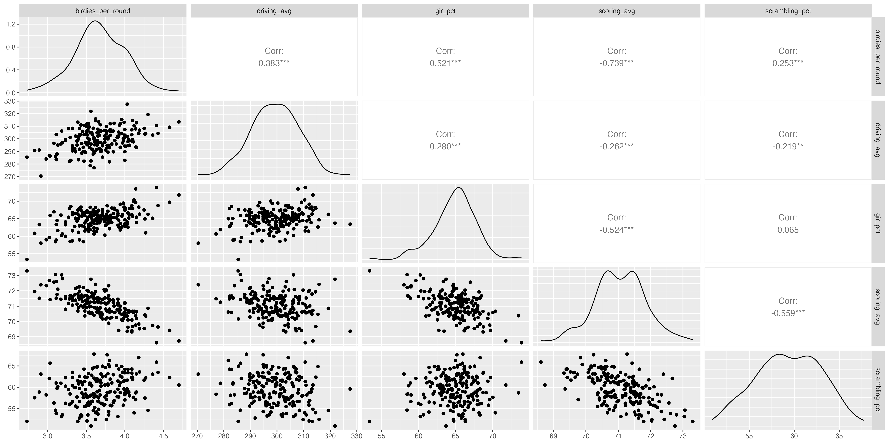
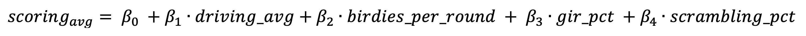
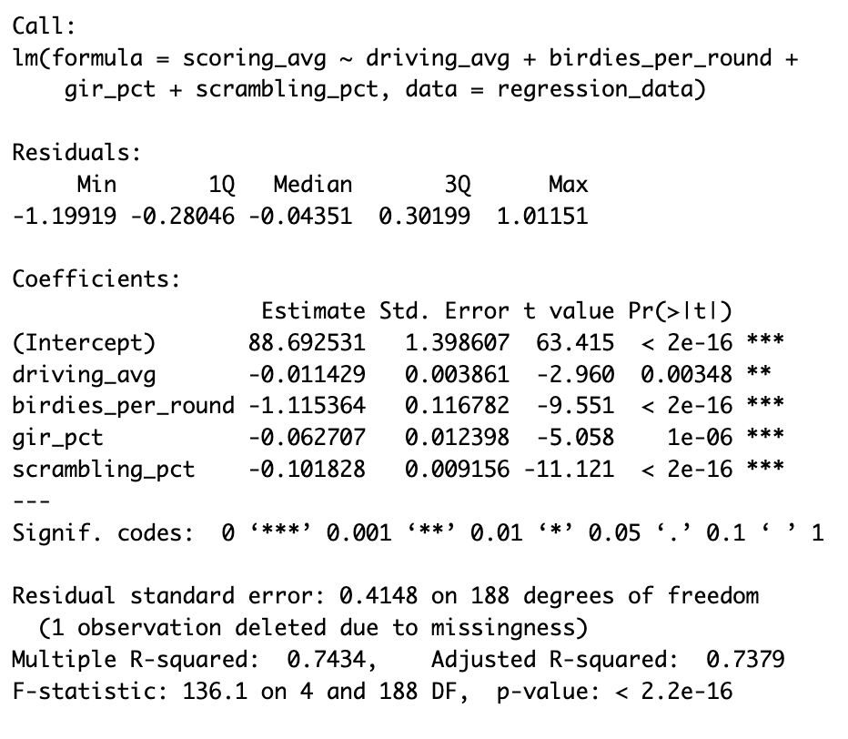
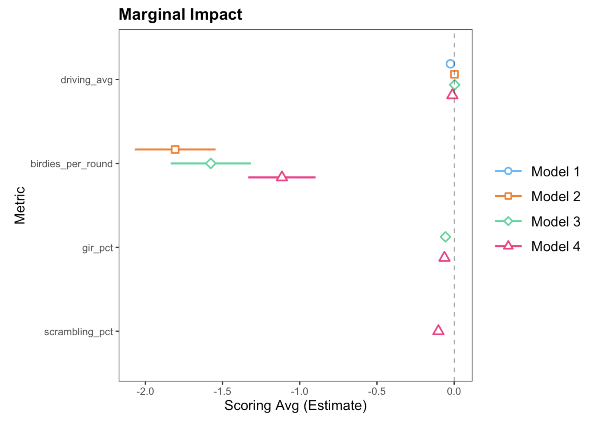
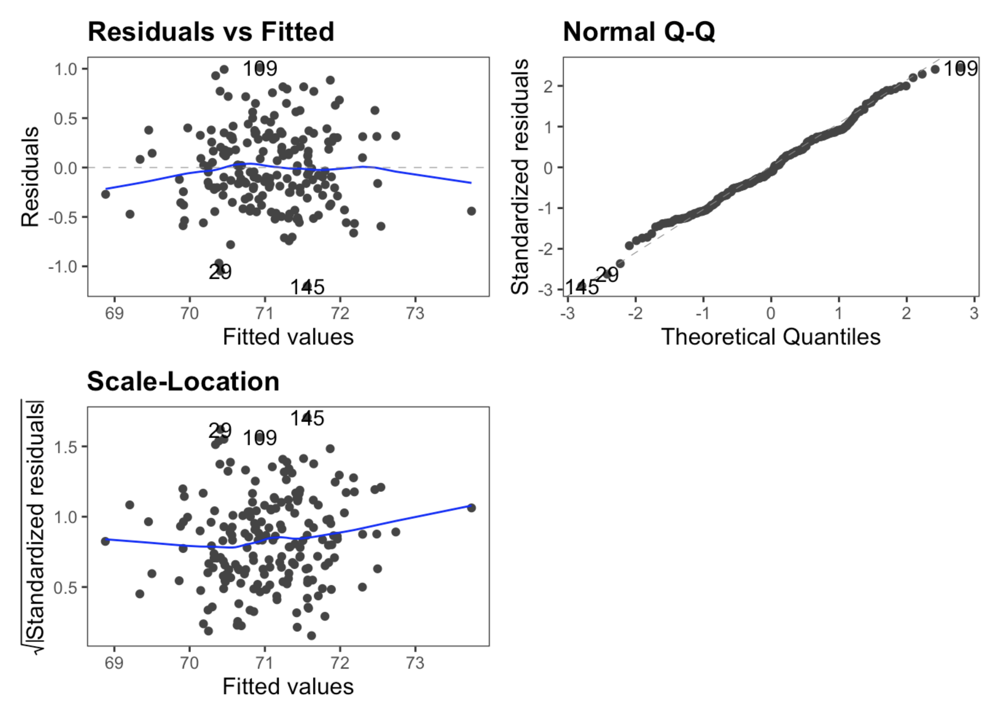

## Intro

Golf is a game of fine margins, and similar to many modern-day sports, data is becoming a larger part of players' practice and on-course decision making.

The [**PGA Tour**](https://www.pgatour.com/stats) website is a great repository for player’s statistical performance throughout the tour’s calendar. Below you can see a basic introductory analysis I have performed; including some exploratory data analysis, as well as a regression to unlock some insights into what drives a good scoring average on the PGA Tour.

[](https://www.pgatour.com/stats)
All of my code can be found in the final section, or you can check out the full project on my [GitHub](https://github.com/maxcheatle/portfolio_projects).

## Data Introduction

Before I commence with some exploratory data anaylsis, let's clearly define all of our variables of interest:

| Variable          | Description                                                                                   |
|----------------|--------------------------------------------------------|
| player            | Player's name                                                                                 |
| rank              | Player's PGA Tour rank in the variable of interest                                            |
| birdies_per_round | The average number of birdies a player makes in each PGA tour round (18 holes)                |
| driving_avg       | The average distance when driving off the tee (yds)                                           |
| gir_pct           | The percentage of greens each player reaches in regulation (GIR = Par -2 strokes)             |
| scoring_avg       | Each player's average 18-hole score (strokes)                                                 |
| scrambling_pct    | Percentage of holes that a player makes par-or-better, when failing to reach GIR (scrambling) |
| overall           | Total performance in all of the above measured metics                                         |

You can also find the .db file I used in the [GitHub repo](https://github.com/maxcheatle/portfolio_projects/tree/main/pga_tour_analysis) for this project.

## Exploratory Data Analysis

### Player Performance Heatmap

First, it’d be good to take a look at player performance as a whole. A good way to visualise this is with a heatmap. You can see this below, and it includes the Top 50 players based on my `overall` rank metric.

To create the `overall` rank metric, I have ranked each player on the PGA Tour by the metrics listed above. I have then created a sum of ranks for each player, and ranked them again based on this, to create their `overall` rank.

I have then filtered for the Top 30 players, for readability, but this can be easily replicated for all players, or a specific group of players, using R dplyr’s handy `filter()` function.

Reading into our heatmap, we can see that the top players all perform extremely well across all categories. This is expected of course, as their ranking is generated from their performances here, but it is still interesting to see that consistent domination of PGA Tour statistics that the top players are able to achieve.

It’s also interesting to see that driving distance, a hot topic in the current age of big-hitting golfers, is not a prerequisite for elite performance levels. Morikawa, Kim, Conners, and Wu all perform outside the Top 50 in average driving distance, yet remain Top 20 overall.

Perhaps most interesting, Burmester is an elite performer in all statistics… except scoring. I’d predict a case of the ‘yips’ may be may play here. Happens to the best!



### Big Hits, Small Scores?

As mentioned, hitting big off the tee is well in trend in the modern golf game. Better technology and technique, more demanding hole lengths, and the never-ending pursuit to maximise risk-reward are all ***drivers*** of this.

But, does crushing the ball as far as possinle actually yield more birdies? Well, *somewhat*. As our plot shows, there is a clear positive correlation between the two metrics. Longer driver’s tend to yield more birdies per round, though not unanimously. Rather, each player must find the risk-reward balance that suits them. Distance is a plus, but you must keep the ball in play consistently to make bank.



## Linear Regression Model

We saw above that `driving_avg` had a positive correlation with `birdies_per_round`. That is, players' who drive the ball further tend to score more birdies per round. However, that does **not** mean that players score more birdies **because** they drive the ball further - we have not shown causality between these two variables.

In this section, I try to determine if there is any causality between driving distance and shooting better scores. That is, does increasing average driving distance generate lower scores in PGA Tour events?

### Variables at Play

Here, I show a correlation matrix of all the variables that I studied during my iterative regression process.

All of our metrics show negative correlations with scoring average. That is, improvements to a player's `driving_avg`, `gir_pct`, and `scrambling_pct` all tend to show reductions in their `scoring_avg`. While `driving_avg` has the weakest correlation of our studied variables, that doesn't really matter. Rather, what we are trying to see is whether or not increasing `driving_avg` yields a negative (improved) `scoring_avg` when we keep `driving_avg`, `gir_pct`, and `scrambling_pct`fixed. That will tell us with reasonable strength if `driving_avg` is a cause of better scores at the highest level of golf.  



###  Model Definition

I have used a linear regression model to undertake this study - this offers simplicity and clarity to the average reader without sacrificing a great deal of model accuracy.



### Model Results

The output of our model confirms some obvious things, but also shows some more interesting points.





#### Birdie Rate

Firstly, `birdies_per_round` is the most influential variable by far. This is expected, since it is our only *direct* scoring metric - a birdie reduces a player's score by 1 and therefore should impact `scoring_avg` by roughly 1. However, perhaps more interestingly, our final model shows that increasing the number of birdies per round by 1, generates a reduction in scoring average by 1.1. Why is that interesting? Well, how does a birdie generate more than its sum in scoring benefits?

This is counter-intuitive, in my opinion. I would have thought that the effect here would be < -1, since scoring a birdie does not guarantee the lack of a forthcoming bogey. This would suggest that a birdie is not quite worth -1, since there is a probability that score will slip later on. However, the result suggests the contrary - players who score one additional birdie may experience a mental boost that allows them to go on and score more birdies.

#### Greens in Regulation and Scrambling

Variables `gir_pct` and `scrambling_pct` both perform similary. That is, a 1 percentage point increase in either metric generates an estimtated 0.1 improvement in a player's `scoring_avg`. This perhaps seems quite small, achieving GIR or being able to consistently scramble should be critical skills. This likely tells us that PGA level players acheive GIR and scramble relatively similarly, and the money-makers are the ones who are able to hole-out putts consistently.

#### Variable of Interest: Average Driving Distance

Our results here tell us that a 1 yard increase in average driving distance yields a 0.01 reduction in player's scoring average. That means, for each yard a player can increase their average driving distance, they will score 0.01 better on average.

This may seem very small, but I find the results here very interesting. Primarily, driving distance does lead to a non-negative increase in tournament performance. Note that a 1-yard increase is relatively small, unless you have already reached diminishing returns to driving distance (i.e. Rory McIlroy is unlikely to increase driving distance, since he already hits it so far). Hence, a 10-15 yard increase can start to have tangible effects on a player's tournament results. Take Viktor Hovland as an example; he's increased his driving distance by approximately 10 yards since 2019, and now finds himself right at the sharp-end of PGA tournaments frequently.

### Regression Diagnostics

From our output tables, we can see that all of our variables are significant at the 1% level, with the exception of `driving_avg`, which is significant at the 5% level. This defends the robustness of the model, although isn't completely perfect. Our adjusted-R-squared value is 73%, a level that I am happy with. Again, it's good but not perfect. Overall, the initial checks show that our model performs well, and I would not expect these metrics to be significantly better. 



From a diagnostic plot perspective, our model also holds up. Our residual versus fitted plot shows relatively strong randomness, with some difficulties at the tails that I am not overly concerned with in this context. The same can be said for the Normal Q-Q plot, which certainly passes the 'fat pen test'. For scale-location, we are looking for a horizontal trend, and I would argue that we meet acceptable levels here too. 

## Code

Here, you can find the code I used to perform each of the above analyses. 

### Packages

```R

library(tidyverse)
library(DBI)
library(janitor)
library(ggforce)
library(grid)
library(png)
library(scales)
library(GGally)
library(ggfortify)
library(margins)
library(jtools)

```

### Database Connection

```R

pga_stats <- DBI::dbConnect(
  drv = RSQLite::SQLite(),
  dbname = here::here("data", "pga_stats.db")
)

DBI::dbListTables(pga_stats)

```

### Database Cleaning

```R

birdies <- data.frame(
  dplyr::tbl(pga_stats, "birdies_per_round")
  ) %>% 
  janitor::clean_names()

driving <- data.frame(
  dplyr::tbl(pga_stats, "driving_distance")
  ) %>% 
  janitor::clean_names()

gir <- data.frame(
  dplyr::tbl(pga_stats, "gir_pct")
  ) %>% 
  janitor::clean_names()

scoring <- data.frame(
  dplyr::tbl(pga_stats, "scoring_avg")
  ) %>% 
  janitor::clean_names()

scrambling <- data.frame(
  dplyr::tbl(pga_stats, "scrambling_pct")
  ) %>% 
  janitor::clean_names()

```

```R

birdies <- birdies %>% 
  select(-movement) %>% 
  rename(birdies_per_round = avg)

driving <- driving %>% 
  select(-movement) %>% 
  rename(driving_avg = avg)

gir <- gir %>% 
  select(-movement) %>% 
  rename(gir_pct = x)

scoring <- scoring %>% 
  select(-movement) %>% 
  rename(scoring_avg = avg)

scrambling <- scrambling %>% 
  select(-movement) %>% 
  rename(scrambling_pct = x)

```

### Heatmap

```R

source("pga_ggplot_theme.R")

# Prepare data for the heatmap
heatmap_data <- birdies %>%
  
  # Joining respecive tables to complete dataset
  left_join(driving, by = "player") %>%
  left_join(gir, by = "player") %>%
  left_join(scoring, by = "player") %>%
  left_join(scrambling, by = "player") %>%
  select(player, birdies_per_round, driving_avg, gir_pct, scoring_avg, scrambling_pct) %>% 
  
  # Changing percentage variables, which are currently characters, to numeric
  mutate(gir_pct = as.numeric(sub("%", "", gir_pct)),
         scrambling_pct = as.numeric(sub("%", "", scrambling_pct))) %>% 
  
  # Changing raw value to group rank
  mutate(birdies_per_round = rank(-birdies_per_round),
         driving_avg = rank(-driving_avg),
         gir_pct = rank(-gir_pct),
         scoring_avg = rank(scoring_avg),
         scrambling_pct = rank(-scrambling_pct)) %>% 
  
  # Creating an overall rank, by summing each player's rank in all metrics, then re-ranking
  group_by(player) %>% 
  mutate(overall = sum(birdies_per_round + driving_avg + gir_pct + scoring_avg + scrambling_pct)) %>% 
  ungroup() %>% 
  mutate(overall = rank(overall)) %>% 
  filter(overall <= 30) %>% 
  
  # Longing the data for plotting
  pivot_longer(cols = c(birdies_per_round, 
                        driving_avg, gir_pct, 
                        scoring_avg, 
                        scrambling_pct), 
               values_to = "rank", 
               names_to = "metric")

# Plot the heatmap
heatmap <- ggplot(heatmap_data, aes(x = reorder(player, overall), y = metric, fill = rank)) +
  geom_tile(color = "white") +
  
  # Using a white to red scale, inspired by PGA colours
  scale_fill_gradient(low = "white", high = "#C71230") + 
  
  # Aesthetic additions
  labs(x = NULL, y = NULL, title = "PGA Player Heatmap", subtitle = "For Top 30 players in 2022/23 PGA Tour tournaments", fill = "Tour Rank") +
  pga_theme +
  theme(axis.text.x = element_text(angle = 90, hjust = 1, size = 12),
        axis.text.y = element_text(size = 12))

ggsave("images/heatmap.png", heatmap, width = 16, height = 8)

```

### Driving Distance vs. Birdie Rate

```R

# Left join the birdies and driving datasets
birdies_distance_plot <- birdies %>% 
  left_join(driving, by = "player") %>% 

  # Create the plot using ggplot
  ggplot(aes(x = birdies_per_round, y = driving_avg)) +

  # Add line segments and labels for Kevin Kisner and Brian Stuard
  geom_segment(data = . %>% filter(player %in% c("Kevin Kisner", "Brian Stuard")),
               aes(x = birdies_per_round, y = driving_avg, 
                   xend = birdies_per_round, yend = driving_avg - 5),
               color = "white") +
  geom_text(data = . %>% filter(player %in% c("Kevin Kisner", "Brian Stuard")),
            aes(label = player, x = birdies_per_round, y = driving_avg - 6), 
            vjust = 1, color = "white", fontface = "bold") +

  # Add line segments and labels for Rory McIlroy and Jon Rahm
  geom_segment(data = . %>% filter(player %in% c("Rory McIlroy", "Jon Rahm")),
               aes(x = birdies_per_round, y = driving_avg, 
                   xend = birdies_per_round, yend = driving_avg + 5),
               color = "white") +
  geom_text(data = . %>% filter(player %in% c("Rory McIlroy", "Jon Rahm")),
            aes(label = player, x = birdies_per_round, y = driving_avg + 7), 
            vjust = 1, color = "white", fontface = "bold") +
  
  # Adding a smoother line, using a linear regression
  geom_smooth(method = lm, color = "green", se = FALSE, linetype = "longdash") +
  
  # Add scatter points with customized aesthetics
  geom_point(size = 3, alpha = 0.7, color = "grey", shape = 21, fill = "grey") +

  # Set axis labels and plot titles with customized text appearance
  labs(x = "Birdies per Round", y = "Driving Distance",
       title = "Relationship between Birdies and Driving Distance",
       subtitle = "PGA Tour Players", caption = "Labels: Best and worst performers in both metrics") +
  theme(plot.title = element_text(color = "white", size = 20, face = "bold"),
        plot.subtitle = element_text(color = "white", size = 14),
        axis.title = element_text(color = "white", size = 12),
        axis.text = element_text(color = "white", size = 10),
        panel.background = element_rect(fill = "#032544"),
        panel.grid = element_blank()) +
  pga_theme

# Save the plot as a PNG image
ggsave("images/birdies_distance_plot.png", birdies_distance_plot, width = 16, height = 8)

```

### Regression

```R

regression_data <- birdies %>%
  
  # Joining respecive tables to complete dataset
  left_join(driving, by = "player") %>%
  left_join(gir, by = "player") %>%
  left_join(scoring, by = "player") %>%
  left_join(scrambling, by = "player") %>%
  select(player, birdies_per_round, driving_avg, gir_pct, scoring_avg, scrambling_pct) %>% 
  
  # Changing percentage variables, which are currently characters, to numeric
  mutate(gir_pct = as.numeric(sub("%", "", gir_pct)),
         scrambling_pct = as.numeric(sub("%", "", scrambling_pct)))

corr_pairs <- regression_data %>% 
  select(-player) %>% 
  ggpairs()
  
ggsave("images/corr_pairs.png", corr_pairs, width = 16, height = 8)

model_1 <- lm(scoring_avg ~ driving_avg, data = regression_data)
summary(model_1)
autoplot(model_1, 1:3)

model_2 <- lm(scoring_avg ~ driving_avg + birdies_per_round, data = regression_data)
summary(model_2)
autoplot(model_2, 1:3)

model_3 <- lm(scoring_avg ~ driving_avg + birdies_per_round + gir_pct, data = regression_data)
summary(model_3)
autoplot(model_3, 1:3)

model_4 <- lm(scoring_avg ~ driving_avg + birdies_per_round + gir_pct + scrambling_pct, data = regression_data)
summary(model_4)
ggplot2::autoplot(model_4, 1:3)

# Creating Plots for Presentation

print(ggplot2::autoplot(model_4, 1:3) +
  theme_apa())

plot_summs(model_1, model_2, model_3, model_4, robust = TRUE) +
labs(title = "Marginal Impact", x = "Scoring Avg (Estimate)", y = "Metric") +
theme_apa()

```