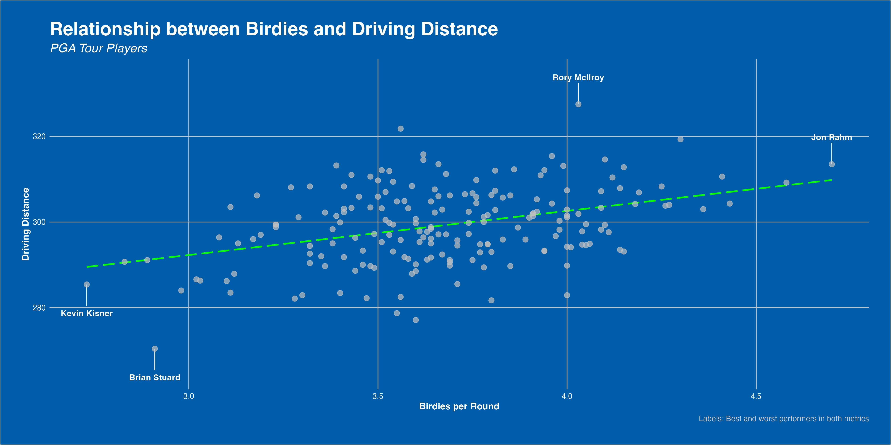

## Intro

Golf is a game of fine margins, and similar to many modern-day sports, data is becoming a larger part of player’s practice and on-course decision making.

The [**PGA Tour**](https://www.pgatour.com/stats) website is a great repository for player’s statistical performance throughout the tour’s calendar. Below you can see a basic introductory analysis I have performed; including some exploratory data analysis, as well as a regression to unlock some insights into what drives a good scoring average on the PGA Tour.

All of my code can be found in the final section, or you can check out the full project on my [GitHub](https://github.com/maxcheatle/portfolio_projects).

## Data Introduction

Before I commence with some exploratory data anaylsis, let's clearly define all of our variables of interest:

| Variable          | Description                                                                                   |
|----------------|--------------------------------------------------------|
| player            | Player's name                                                                                 |
| rank              | Player's PGA Tour rank in the variable of interest                                            |
| birdies_per_round | The average number of birdies a player makes in each PGA tour round (18 holes)                |
| driving_avg       | The average distance when driving off the tee (yds)                                           |
| gir_pct           | The percentage of greens each player reaches in regulation (GIR = Par -2 strokes)             |
| scoring_avg       | Each player's average 18-hole score (strokes)                                                 |
| scrambling_pct    | Percentage of holes that a player makes par-or-better, when failing to reach GIR (scrambling) |
| overall           | Total performance in all of the above measured metics                                         |

You can also find the .db file I used in the [GitHub repo](https://github.com/maxcheatle/portfolio_projects/tree/main/pga_tour_analysis) for this project.

## Exploratory Data Analysis

### Player Performance Heatmap

First, it’d be good to take a look at player performance as a whole. A good way to visualise this is with a heatmap. You can see this below, and it includes the Top 50 players based on my `overall` rank metric.

To create the `overall` rank metric, I have ranked each player on the PGA Tour by the metrics listed above. I have then created a sum of ranks for each player, and ranked them again based on this, to create their `overall` rank. 

I have then filtered for the Top 30 players, for readability, but this can be easily replicated for all players, or a specific group of players, using R dplyr’s handy `filter()` function.

Reading into our heatmap, we can see that the top players all perform extremely well across all categories. This is expected of course, as their ranking is generated from their performances here, but it is still interesting to see that consistent domination of PGA Tour statistics that the top players are able to achieve. 

It’s also interesting to see that driving distance, a hot topic in the current age of big-hitting golfers, is not a prerequisite for elite performance levels. Morikawa, Kim, Conners, and Wu all perform outside the Top 50 in average driving distance, yet remain Top 20 overall. 

Perhaps most interesting, Burmester is an elite performer in all statistics… except scoring. I’d predict a case of the ‘yips’ may be may play here. Happens to the best!

### Big Hits, Small Scores? 

As mentioned, hitting big off the tee is well in trend in the modern golf game. Better technology and technique, more demanding hole lengths, and the never-ending pursuit to maximise risk-reward are all ***drivers*** of this. 

But, does crushing the ball down the fairway actually yield more birdie chances? Well, *somewhat*. As our plot shows, there is a clear positive correlation between the two metrics. Longer driver’s tend to yield more birdies per round, though not unanimously. Rather, each player must find the risk-reward balance that suits them. Distance is a plus, but you must keep the ball in play consistently to make bank.

