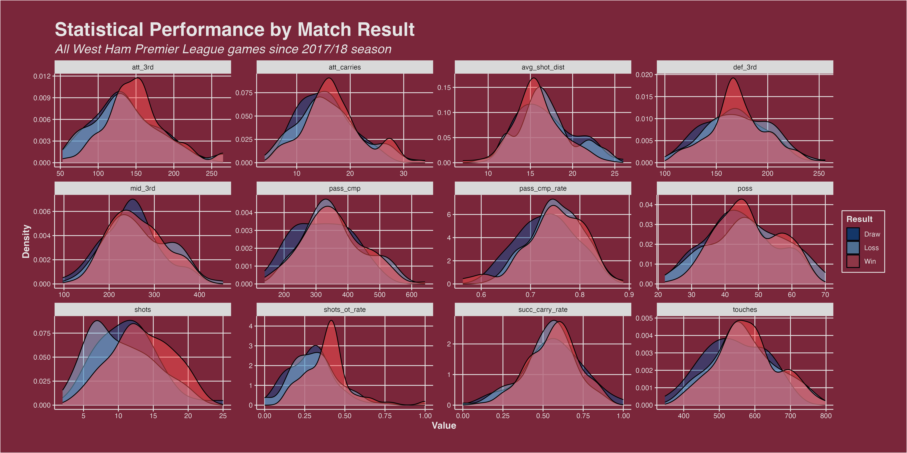

## Intro

Here, I take a look at West Ham's statistical performance in the Premier League since the 2017/18 season. To retrieve the data, I have used web scraping with R packages `rvest` and `robotstxt`.

*Note: To protect the integrity of the website I have scraped from, I have opted not to share any of the code or raw data used.*

## The Hunt for Points

Wherever your favourite team lies in the Premier League table, the weekly neccessity to score points holds true for everyone. So, since the 17/18 season, how often do West Ham score points?


Unsuprisingly, West Ham aren't exactly winning every week... But, there is a positive to take from the *relatively* high 58% rate that West Ham do score points in the Premier League.

For context, in the modern-day 38-game Premier League season, a team winning 36% and drawing 22% of games would collect 49.4 points (49). That's well clear of the pundits' famous 40 points to secure Premier League safety, and would typically be enough to finish around 10th.

## Winners and Losers

So, we've now seen that while West Ham certainly aren't the scariest football team around, they are more than capable of giving the top teams a run for their money. But, since 17/18, what teams have the East Londoner's had the most success against? Who are their bogey teams?


Here, we see the 9 teams that West Ham have most frequently beat since 17/18. Unfortunately for the Hammers', only two of these teams remain in the Premier League (Fulham, Aston Villa). 

Note that some of the teams here have a small sample size, like Huddersfield, who West Ham have only played 2 times since the 17/18 season due to their single-year appearance in the top divison during the studied period. 


Now let's take a look at the teams West Ham don't fancy playing against. Straight away, we see that West Ham have never beat Brentford in the Premier League, in 4 attempts since 2017/18 - though did beat Brentford in the 22/23 FA Cup 8 days after a dissapointing 2-0 loss in the Premier League. A bit of a bogey team from West Ham's perspective.

Other bogey teams include Wolves, Brighton, Cardiff and Newcastle, all of whom West Ham only beat in 50% of their league ties. Liverpool, Manchester City, Arsenal, and Manchester United are all more obvious candidates that West Ham have showed inability to beat frequently. 

## Fine Margins

Now we've had a brief look at West Ham's performaces over the past 5 years, let's explore the statistical differences between wins (W), draws (D), and losses (L). 



The overwhelming observation to be made here is that there are limited clear performance deviations by match result. This goes to show the fine margins between wins, draws, and losses, at the top level of English football. 

Of the selected variables, `shots` (number of shots) and `shot_ot_rate` (% of shots taken that are on target) are the only variables that stand-out when comparing wins to losses and draws. Variables `att_3rd` (touches in the attacking third of the pitch) and `def_3rd` (touches in the defensive third) have a tighter distribution when West Ham win, versus draws and losses, which have a wider distribution of perfromances. 

## Code

Here, you can find the code I used to create the above visualistions. 

### Reference Code

```R

# Some References
source("west_ham_theme.R")
num_shades <- 3
blues <- brewer.pal(num_shades, "Blues")
blue_shades <- colorRampPalette(c("#FFFFFF", "#82C0E5"))(9)
blue_shades <- colorRampPalette(c("#FFFFFF", "#82C0E5"))(9)
red_shades <- colorRampPalette(c("#FF5050", "#FFFFFF"))(9)
contrast_colors <- c("#0B4D92", "#82C0E5", "#FF5050")

```

### Theme (ggplot2)

```R

west_ham_claret <- "#7A263A"
west_ham_sky_blue <- "#82C0E5"
west_ham_dark_blue <- "#1C1E3F"
west_ham_light_gray <- "#E6E6E6"

west_ham_theme <- theme(
  panel.background = element_rect(fill = west_ham_claret),
  panel.grid.major = element_line(color = west_ham_light_gray),
  panel.grid.minor = element_blank(),
  panel.border = element_blank(),
  axis.line = element_line(color = west_ham_light_gray),
  axis.ticks = element_line(color = west_ham_light_gray),
  axis.text = element_text(color = west_ham_light_gray),  # Set axis text color to white
  axis.title = element_text(color = west_ham_light_gray, size = 12, face = "bold"),
  legend.background = element_rect(fill = west_ham_claret, color = west_ham_light_gray),
  legend.title = element_text(color = west_ham_light_gray, face = "bold"),
  legend.text = element_text(color = west_ham_light_gray),
  legend.key = element_rect(fill = west_ham_dark_blue),
  plot.title = element_text(color = west_ham_light_gray, size = 24, face = "bold"),
  plot.subtitle = element_text(color = west_ham_light_gray, size = 16, face = "italic"),
  plot.caption = element_text(color = west_ham_light_gray, size = 10),
  plot.background = element_rect(fill = west_ham_claret),
  plot.margin = unit(c(1, 1, 1, 1), "cm")
)


```

### Match Results Plot

```R

# Calculate the percentage of total games
match_results_summary <- match_results %>%
  group_by(result) %>%
  summarise(number = n()) %>%
  mutate(percentage = number / sum(number) * 100)

# Plotting bar chart
match_results_plot <-  ggplot(match_results_summary, aes(x = factor(result, levels = c("W", "D", "L")), y = number)) +
  geom_bar(stat = "identity", fill = blues, position = position_dodge(width = 0.5)) +
  geom_text(aes(label = paste0(round(percentage), "%")), vjust = 2, color = west_ham_dark_blue, size = 4) +
  west_ham_theme +
  labs(title = "West Ham results since 2017/18 season",
       subtitle = "Premier League games only",
       x = "Result",
       y = "Number of Matches",
       fill = "Result")

ggsave("images/match_results.png", match_results_plot, width = 16, height = 8, dpi = 1000)

```

# Best and Worst Opponents

```R

t9_opponents <- match_results %>% 
  select(result, opponent) %>% 
  group_by(opponent, result) %>% 
  summarise(count = n()) %>% 
  mutate(total_games = sum(count),
         rate = round(count/total_games*100, 2)) %>% 
  filter(result == "W") %>%
  arrange(desc(rate)) %>%
  head(9)

t9_opponents_plot <- t9_opponents %>%
  ggplot(aes(x = reorder(opponent, -rate), y = rate, fill = reorder(opponent, rate))) +
  geom_bar(stat = "identity") +
  scale_fill_manual(values = blue_shades) +
  west_ham_theme +
  labs(
    title = "West Ham's Favourite Opponents",
    subtitle = "Win rate in all Premier League games since 2017/18",
    x = NULL,
    y = "Win Rate (%)",
    fill = "Result",
    color = "Opponent"
  ) +
  theme(
    axis.text.x = element_text(size = 14, angle = 90, hjust = 1),
    panel.grid.major = element_blank(),
    panel.grid.minor = element_blank()
  )

ggsave("images/wins.png", t9_opponents_plot, width = 16, height = 8, dpi = 1000)

b9_opponents <- match_results %>% 
  select(result, opponent) %>% 
  group_by(opponent, result) %>% 
  summarise(count = n()) %>% 
  mutate(total_games = sum(count),
         rate = round(count/total_games*100, 2)) %>% 
  filter(result == "L") %>%
  arrange(desc(rate)) %>%
  head(9)

b9_opponents_plot <- b9_opponents %>%
  ggplot(aes(x = reorder(opponent, -rate), y = rate, fill = reorder(opponent, -rate))) +
  geom_bar(stat = "identity") +
  scale_fill_manual(values = red_shades) +
  west_ham_theme +
  labs(
    title = "West Ham's Least Favourite Opponents",
    subtitle = "Win rate in all Premier League games since 2017/18",
    x = NULL,
    y = "Win Rate (%)",
    fill = "Result",
    color = "Opponent"
  ) +
  theme(
    axis.text.x = element_text(size = 14, angle = 90, hjust = 1),
    panel.grid.major = element_blank(),
    panel.grid.minor = element_blank()
  )

ggsave("images/losses.png", b9_opponents_plot, width = 16, height = 8, dpi = 1000)

```

### Performances by Result

```R

result_performances_plot <- match_results %>%
  select(game_id, result, poss) %>%
  left_join(combined_shooting, "game_id") %>%
  left_join(combined_passing, "game_id") %>%
  left_join(combined_poss, "game_id") %>%
  select(game_id, result, poss, shots, shots_ot_rate, avg_shot_dist, pass_cmp, pass_cmp_rate, touches, att_carries, succ_carry_rate, def_3rd, mid_3rd, att_3rd) %>%
  pivot_longer(poss:att_3rd, names_to = "metric", values_to = "value") %>%
  ggplot(aes(x = value, fill = result)) +
  geom_density(alpha = 0.5) +
  facet_wrap(~ metric, scales = "free") +
  scale_fill_manual(values = contrast_colors, labels = c("W" = "Win", "D" = "Draw", "L" = "Loss")) +
  west_ham_theme +
  labs(title = "Statistical Performance by Match Result",
       subtitle = "All West Ham Premier League games since 2017/18 season",
       x = "Value",
       y = "Density",
       fill = "Result")

ggsave("images/result_performances.png", result_performances_plot, width = 16, height = 8, dpi = 1000)
ggsave("images/cover.png", result_performances_plot, width = 16, height = 5, dpi = 1000)

```